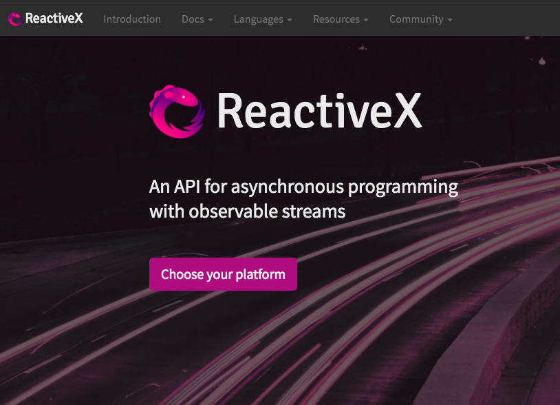
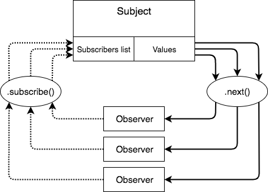
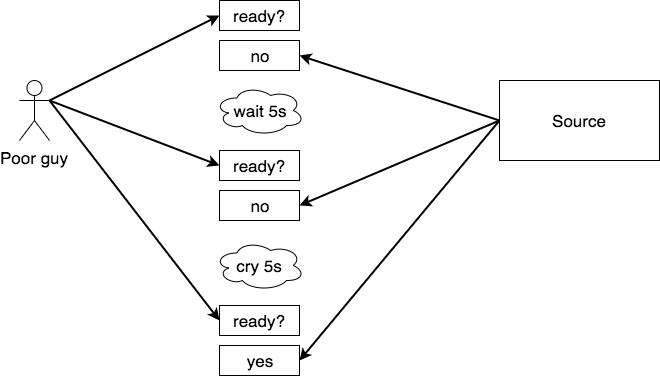

# RxJS Intro

Streams... Streams everywhere... 🎏

<small>Ricardo Martinez [@lordrip](http://twitter.com/lordrip)</small>

---

## About myself

### Ricardo Martinez
##### Software engineer @ Dynatrace
##### Typescript, JavaScript & Python huge fan.
##### Paranormal bug hunter 👻

---

##### What Rx stands for?

Rx is the acronym of Reactive Extensions which is a library based on the Observer pattern in a functional fashion

--

##### What is RxJS then?

RxJS is the Javascript version of the Reactive Extensions. (Rx)

There is also versions for:
- .Net
- Python
- Java
- Scala
- Swift

---

##### Let's quickly review the Observer pattern

>The observer pattern is a software design pattern in which an object, called the subject, maintains a list of its dependents, called observers, and notifies them automatically of any state changes, usually by calling one of their methods.

><cite>Wikipedia</cite>

--

--

##### Why should I care?

To avoid do something like this...

--

##### Polling workflow

--

<iframe src="https://giphy.com/embed/2CdwFeWTJ2xFK" width="423" height="480" frameBorder="0" class="giphy-embed" allowFullScreen></iframe>

<small>thanks giphy</small>

---

##### Let's implement our own Subject

<pre><code class="hljs javascript">
export class BasicSubject&lt;T&gt; {
  private readonly observers: Function[] = [];

  subscribe(handler: Function): void {
    if (typeof handler !== 'function') return;

    this.observers.push(handler);
  }

  next(value: T): void {
    this.observers.forEach((fn) => { fn(value); });
  }
}
</code></pre>

--

##### Let's use our own Subject

<pre><code class="hljs javascript">
import { BasicSubject } from './basic-subject';

const subject = new BasicSubject<number>();

subject.subscribe((value) => {
  // do something with the value 😄
  console.log({ value });
})

subject.next(10);

// console prints
{ value: 10 }
</code></pre>

--

##### Demo time with Stackblitz

[demo](https://stackblitz.com/edit/basic-subject?file=index.html)

--

##### So far, so good

But... wouldn't be nice to have a mechanism to unsubscribe from the source, emit different kind of values, manipulate, filter or delay the values?

There's where RxJS shines ☀️😎

---

##### Getting serious with RxJS 🦸🏻‍♂️

Before going forward, please notice that we've used different concepts here:

* Observer
* Observable
* Subject

--

##### Observer

Observer in the RxJS context is just an object which has 3 function properties:

<pre><code class="hljs javascript">
{
  next: (value) => { ... } // Called when a value is emitted
  error: (error) => { ... } // Called when an error has been thrown
  next: () => { ... } // Caled when the stream completes
}
</code></pre>

--

##### Observable

>Observable is just a function that takes an observer and returns a function to tear down.

><cite>Ben Lesh</cite>

--

##### Observable Example

<pre><code class="hljs javascript">
const myObservable = (observer) => {
  const image = new Image();

  image.onprogress = (progress) => { observer.next(progress); };
  image.onerror = (error) => { observer.error(error); };
  image.onload = () => { observer.complete(); };

  image.src = ...some blob data...

  return () => { ... } // tear down code goes here.
}
</code></pre>

--

##### Subject

Subjects has the following features:

- Maintains a list of registered observers
- Has the means to call the <code>next</code> method into each observer
- Also has the capability to send data over the stream. 👀

--

##### Subject Example

<pre><code class="hljs javascript">
const mySubject = new BasicSubject();
const observer = { next: ..., error: ..., complete: ... };

// keeps an internal list of registered observers.
mySubject.subscribe(observer);

// push data into the stream
mySubject.next('myValue');

// observer.next('value'); is called by mySubject.
</code></pre>

--

##### Summary

Observable: usually used for a disposable value (http requests, image loading...)

Subject: usually used when we need to control the emitted value manually ourselves (trigger executions, reloads...)

---

### Now Getting REALLY serious with RxJS 🦸🏻‍♂️

<small>I promise 😅</small>

---

##### Ways to create Observables

- const myObservable = new Observable(observer);
- const myObsFromEvent = fromEvent(button, 'click');
- const mergedObs = combineLatest(sourceA, sourceB);

--

##### fromEvent

<code>fromEvent</code> creates an observable that emits selected events from target element in the same way like addEventListener();

<pre><code class="hljs javascript">

const btn = document.getElementById('myBtn');
const myObs = fromEvent(btn, 'click');

myObs.subscribe({
  next: (event) => { console.log(event); },
});

// when clicking the button, it prints to console
// MouseEvent { isTrusted: true, screenX: 388... }
</code></pre>

--

##### combineLatest

<code>combineLatest</code> creates an observable combining two or more sources and emitting when both has emitted
<pre><code class="hljs javascript">
const myObs = combineLatest(
  httpObservable('http://url.com'),
  httpObservable('http://url2.com'),
);

myObs.subscribe({
  next: (event) => { console.log(event); },
});
/* when both httpCalls are resolved, it prints to console
[
  { response: { status: 200 } },
  { responseB: { status: 200 } }
]
*/
</code></pre>

--

##### there are many more

* <code>of</code>
* <code>from</code>
* <code>zip</code>
* <code>mergeAll</code>
* and still many more... 🤯

---

##### Types of RxJS Subjects

- Subject
- ReplaySubject
- BehaviorSubject

--

##### Subject

Subject is the basic implementation which allow us to emit values to the stream

<pre><code class="hljs javascript">
const mySubject = new Subject();

mySubject.subscribe({
  next: (event) => { console.log(event); },
});

mySubject.next('value 1');
mySubject.next('value 2');

// prints to the console
// value 1, value 2
</code></pre>

--

let's see another example

<pre><code class="hljs javascript">
const mySubject = new Subject();

mySubject.next('please do not ignore me');
mySubject.next('please do not ignore me');

mySubject.subscribe({
  next: (event) => { console.log(event); },
});

// prints to the console
// ???
</code></pre>

--

<iframe src="https://giphy.com/embed/h7noFsLU9Ekj6" width="480" height="360" frameBorder="0" class="giphy-embed" allowFullScreen></iframe>

<small>thanks giphy</small>

--

So far we have been subscribing to the subject BEFORE the value was emitted,
this is a hot observable which simply means that values are emitted even though there's no subscribers.

What happen when we subscribe AFTER the value is emitted? Then the value is lost and we get...

--

<iframe src="https://giphy.com/embed/3o85fYKy0R91nLbtte" width="480" height="256" frameBorder="0" class="giphy-embed" allowFullScreen></iframe>

<small>thanks giphy</small>

--

##### ReplaySubject

ReplaySubject inherits from Subject and has the particularity of repeat a given number of times on each subscription.

<pre><code class="hljs javascript">
const mySubject = new ReplaySubject(2);

mySubject.next('I like NADA ENCHILADA');
mySubject.next('Simon says');

mySubject.subscribe({
  next: (event) => { console.log(event); },
});

// prints to the console
// I like NADA ENCHILADA, Simon says
</code></pre>

--

##### BehaviorSubject

BahaviorSubject also inherits from Subject but in this case, we can provide an initial value to be submitted if no value has been delivered yet

<pre><code class="hljs javascript">
const mySubject = new BehaviorSubject('NADA ENCHILADA NOW');

mySubject.subscribe({
  next: (event) => { console.log(event); },
});

// immediately prints
// NADA ENCHILADA NOW

mySubject.next('🍔🍔🍔');

// prints to the console
// 🍔🍔🍔
</code></pre>

---

##### Operators

Operators are plain functions which are used to transform the stream or its value.

This functions are used with an special method from the Observable class called <code>.pipe()</code>

--

##### A few operators

- startWith()
- map()
- filter()
- take()
- takeWhile()
- takeUntil()
- withLatestFrom()
- tap()

--

##### startWith

startWith is to give an initial value to the stream

<pre><code class="hljs javascript">
subject.pipe(
  startWith('initial Value'),
);

subject.subscribe(console.log);

// prints to the console
// initial Value
</code></pre>

--

##### map

map is used to transform values form the stream

<pre><code class="hljs javascript">
subject.pipe(
  startWith(10),
  map((value) => value * 2),
);

subject.subscribe(console.log);

// prints to the console
// 20
</code></pre>

--

##### filter

filter is used for... filter

<pre><code class="hljs javascript">
subject.pipe(
  startWith(1, 2, 3, 4),
  filter((value) => (value % 2) === 0),
);

subject.subscribe(console.log);

// prints to the console
// 2, 4
</code></pre>

--

##### take

take is used for receive a given number of values and then unsubscribe from the source

<pre><code class="hljs javascript">
subject.pipe(
  startWith(1, 2, 3, 4),
  take(2),
);

subject.subscribe(console.log);

// prints to the console
// 1, 2
</code></pre>

--

##### takeWhile

takeWhile is used for receive values while a given condition is met, when this is no longer true, then unsubscribe from the source

<pre><code class="hljs javascript">
subject.pipe(
  startWith(1, 2, 3, 4, 5, 6),
  takeWhile((value) => value < 4),
);

subject.subscribe(console.log);

// prints to the console
// 1, 2, 3
</code></pre>

--

##### takeUntil

takeUntil is used for receive values until another source emits.

<pre><code class="hljs javascript">
const source = interval(1000)
  .pipe(
    takeUntil(interval(5000)),
  );

source.subscribe(console.log);

// prints to the console
// waits 1s, then 0, waits 1s, then 1, and so on, after 5s stop receiving values.
</code></pre>

--

##### withLatestFrom

withLatestFrom is used for getting a emitted value from another source and add it to the stream.

<pre><code class="hljs javascript">
const sourceB = new BehaviorSubject('another value');

const subject = new Subject()
  .pipe(
    startWith('initial value')
    withLatestFrom(sourceB),
  );

subject.subscribe(console.log);

// prints to the console
// [ 'initial value', 'another value' ]
</code></pre>

--

##### tap

tap is used for doing side effects within the stream

<pre><code class="hljs javascript">
const subject = new Subject()
  .pipe(
    startWith('initial value')
    tap(console.log),
  );

subject.subscribe();

// prints to the console
// 'initial value'
</code></pre>

---

##### More info

- https://rxjs-dev.firebaseapp.com/
- https://rxviz.com/
- https://github.com/ReactiveX/rxjs

---

<iframe src="https://giphy.com/embed/3oEdva9BUHPIs2SkGk" width="480" height="480" frameBorder="0" class="giphy-embed" allowFullScreen></iframe>

a lot!
