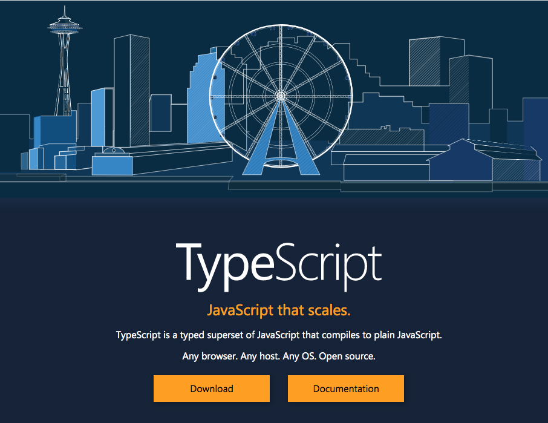

# Typescript

and its types...

<small>Ricardo Martinez [@lordrip](http://twitter.com/lordrip)</small>

---

## About myself

### Ricardo Martinez
##### Software engineer @ Dynatrace
##### Typescript, JavaScript & Python huge fan.
##### Paranormal bug hunter 👻

---

##### What is Typescript?

Typescript is a typed superset of Javascript that compiles to plain Javascript.

--

##### Some nice features

* Compile time types checks
* Intellisense (Microsoft syntax autocompletion)
* Compile down to Javascript directly (particularly nice for server applications)
* Extremely rich type system

--

##### Let's focus on

* ~~Compile time types checks~~
* ~~Intellisense (Microsoft syntax autocompletion)~~
* ~~Compile down to Javascript directly (particularly nice for server applications)~~
* Extremely rich type system

---

##### Extremely rich type system

Typescript support a nice set of advanced types because of the highly dynamic nature of Javascript.

* Intersection types
* Union types
* Type Guards
* Signature overload
and more.

---

##### Intersection types

Combines two or more types into one.

<pre><code class="hljs javascript">

type Vehicle = { maxSpeed: number };
type Car = { doors: number };

type IntersectedType = Vehicle & Car;

// this is interpreted as
IntersectedType {
  maxSpeed: number;
  doors: number;
}

</code></pre>

---

##### Union types

Describes a type that can be one of several types

<pre><code class="hljs javascript">

type UnionType = string | number;

// we can use like this
function padLeft(value: string, padding: string | number): string {
  if (typeof padding === 'string') {
    // string logic goes here
  }

  // number logic goes here since TS infer automatically that the value is number
}

</code></pre>

---

##### Type guards

Since all the type information is discarded after compile time, nothing prevent that a value coming from outside is not the right type.

Let's consider the following example.

--

<pre><code class="hljs javascript">
type Person = { name: string; lastLogin: number };

function getLoggedTime(person: Person): number {
  return Date.now() - person.lastLogin;
}

person = getPersonFromSuspiciousAPI();
/* returns person = {
  name: 'Person name',
  lastLogin: '1578405297000',
} */

getLoggedTime(person); // 🤔
</code></pre>

--

In fact, nothing 🤷‍♂, since we're performing an operation with different primitive types, then the second one will be casted to number as well 😇

* [Equality comparisons and sameness](https://developer.mozilla.org/en-US/docs/Web/JavaScript/Equality_comparisons_and_sameness)
* [ECMAScript language spec](http://ecma-international.org/ecma-262/5.1/#sec-11.9.3)

but what about a real example?

--

<pre><code class="hljs javascript">
function getImageBlob(imageId: string): Blob { ... }

const blob = getImageBlob('image-id'); // Blob:... ✅

URL.createObjectUrl(blob); // ✅
canvasContext.drawImage(blob, 0, 0); // ✅

</code></pre>

--

What about this?

<pre><code class="hljs javascript">

function getImageBlob(imageId: string): Blob { ... }

const blob = getImageBlob('image-id');
// returns JSON: { retryToken: "2ee9c614-0f5c..." }

URL.createObjectUrl(blob); // 🚨
// Uncaught TypeError: Failed to execute 'createObjectURL'
// on 'URL': No function was found that matched
// the signature provided.

canvasContext.drawImage(blob, 0, 0); // 🚨

</code></pre>

--

A type guard is a compile time and a runtime check for this kind of expressions.

<pre><code class="hljs javascript">
function isValidBlob(blob: Blob | unknown): blob is Blob {
  return blob instanceof Blob
    && blob.type !== 'application/json';
}

</code></pre>

--

Using it

<pre><code class="hljs javascript">
function getImageBlob(imageId: string): Blob | RetryToken { ... }
const blob = getImageBlob('image-id');
// returns JSON: { retryToken: "2ee9c614-0f5c..." }

if (!isValidBlob(blob)) {
  return; // or retry mechanism logic...
}

// at this stage both compile and runtime are sure
// that the value is Blob
URL.createObjectUrl(blob); // ✅

canvasContext.drawImage(blob, 0, 0); // ✅

</code></pre>

---

##### Signature overload

Since Javascript is such a dynamic language, isn't uncommon to see that a function could return different types depending of its arguments.

<pre><code class="hljs javascript">
new Date()
// Tue Jan 07 2020 15:00:00 GMT+0100 (Central European Standard Time)

new Date('2019-12-01')
// Sun Dec 01 2019 01:00:00 GMT+0100 (Central European Standard Time)

new Date(0)
// Thu Jan 01 1970 01:00:00 GMT+0100 (Central European Standard Time)

new Date(1974, 0, 1)
// Thu Jan 01 1970 01:00:00 GMT+0100 (Central European Standard Time)

</code></pre>

--

For this to be possible, the Date object has several overloads.

<pre><code class="hljs javascript">
interface Date {
  new(): Date;

  new(value: number | string): Date;

  new(year: number, month: number,
    date?: number, hours?: number,
    minutes?: number, seconds?: number,
    ms?: number,
  ): Date;
}

</code></pre>

--

For implementing a function signature overload we just need to put all the possible combinations of the function

<pre><code class="hljs javascript">
type FilterFunction = {
  (list: string[], filterKey: string): string[];
  (list: number[], filterKey: number): number[];
}

const filterImpl: FilterFunction = (list: string[] | number[], filterKey: string | number) => {
  return [];
}

</code></pre>

--

Combining function overloads with string literal types, we could define an API like DOM's API

<pre><code class="hljs javascript">
document.createElement('a'); // HTMLAnchorElement
document.createElement('div'); // HTMLDivElement

</code></pre>

--

##### Examples

* [Overload](https://stackblitz.com/edit/typescript-overloads?file=01_overload_signature.ts) ⛓
* [Overload & String Literals](https://stackblitz.com/edit/typescript-overloads?file=02_overload_string_literal.ts) ⛓

--

##### How works the DOM Api definition

<pre><code class="hljs javascript">
createElement<K extends keyof HTMLElementTagNameMap>(tagName: K, options?: ElementCreationOptions): HTMLElementTagNameMap[K];

</code></pre>
